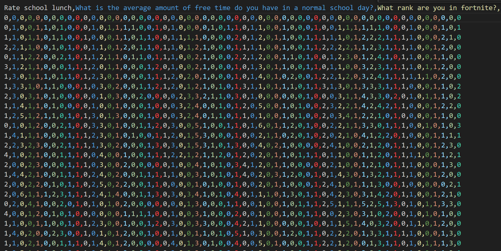

# Ninth Grade Data Visualization

Run all scripts from folder root (location of this page)

## For grading

**This section is for my AP CSP teacher.**
Open up Microsoft Excel and save the 9th grade dataset as a CSV file and put it in the root of this folder.
After this, run `utils/filter_unique.py` and set the file name as `multichoice.csv`. Then, run `clean_data.py` which doesn't take arguments and runs in place if `multichoice.csv` exists, then saves it to `cleaned_multichoice.csv`.

`cleaned_multichoice.csv` should now look like this:

You are now ready to run the code in analysis.ipynb

## Various column name changes

Refer to the following tables for column name abbreviation/shortening.

| Original question                                     | Modified name        |
| ----------------------------------------------------- | -------------------- |
| Do you think you are smarter than the average person? | smarter_than_average |
