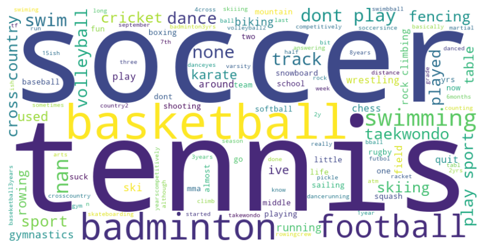
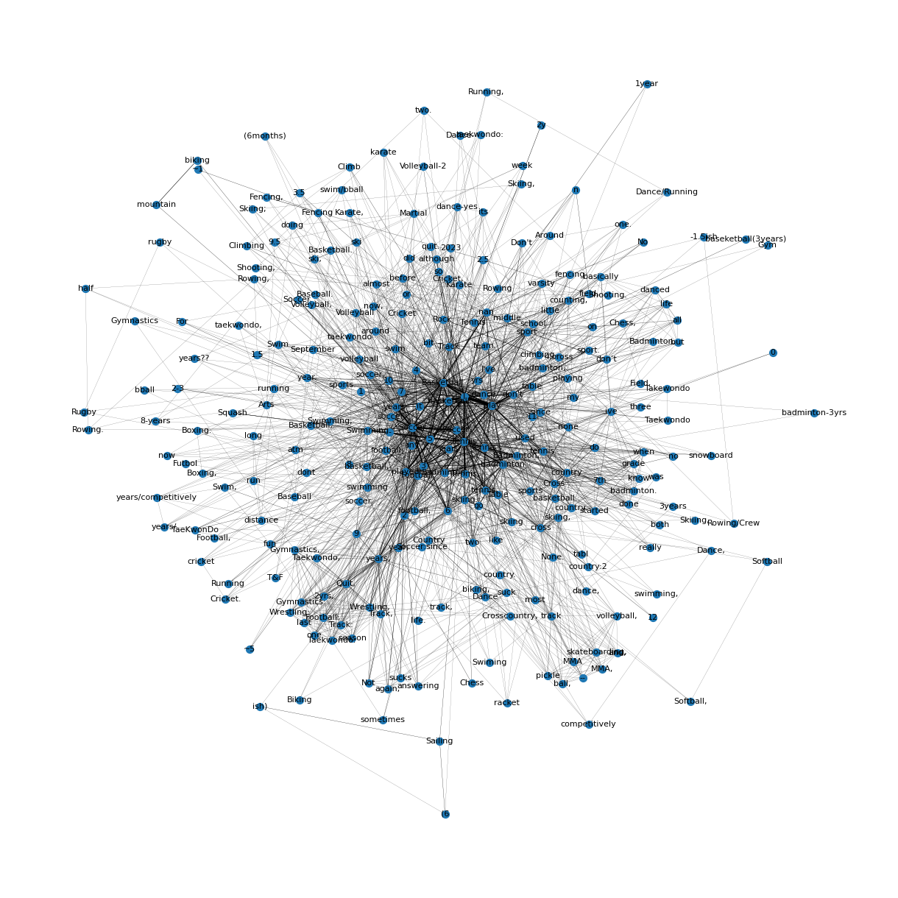

# Visualizations and explanations

This is also available on my website in a [blog post](https://www.parthiv.dev/blog/ninthgrade-data-analysis)

## Links to sections

- [Visualizations and explanations](#visualizations-and-explanations)
  - [Links to sections](#links-to-sections)
  - [Code source](#code-source)
  - [Correlation chart](#correlation-chart)
  - [Strongest correlations](#strongest-correlations)
  - [Interesting correlations](#interesting-correlations)
  - [Calculating the strongest correlations](#calculating-the-strongest-correlations)
  - [Analyzing the sport-related data](#analyzing-the-sport-related-data)

## Code source

All code is original content and available in `analysis.ipynb`. It works for my environment and on GitHub, so there's no reason it shouldn't work for you if you run everything sequentially.

## Correlation chart

The correlation matrix is used to find columns that relate to each other or _correlate_. This can help brainstorm ideas for future visualizations. My code randomly chooses 20 columns from the cleaned data and analyzes the correlation. You only need to look at the data under and to the left of the red squares as it is mirrored to the other side.

## Strongest correlations

My code selects the 12 strongest correlations from the 58x163 cleaned dataset.

On a side note, I wanted to talk about the complexity of these operations and the math behind them.

## Interesting correlations

Seeing as the highest correlation has a R-score (statistics term for correlation strength) of 0.5, most of these correlations are pretty weak. However, they do denote a relationship.

Here's some of the stronger correlations that I found interesting or made sense to me. I also included my thoughts on why this is the case.

- HTML and Javascript rank first and have the strongest correlation. The question asks people to select how much expertise they have with the language. I believe the reason for this is that HTML and JS are usually taught together to web developers and make up the bulk of the World Wide Web (aside from simple, static sites).
- "How do you get to school now?" and Python proficiency. This one is a difficult one. I'm not sure why it has a correlation of about 0.46 but maybe it's because kids who know more Python tend to have parents that work harder and drive them to school or they live farther away so they take the bus?
- GP (the graphic production class) and history rank fourth on this list. History is one of the humanities and so is art, so maybe this is because GP is similar to art and people are interested in both?
- "Do you think that you are smarter than average?" and C++ have a decently strong correlation. C++ developers are supremacists.

## Calculating the strongest correlations

Let's break this down:

- Calculating the pairwise correlation for a matrix of size `m x n` (m is the number of rows, n is the number of columns) generally has a time complexity of `O(n^2 * m)` because each pair of columns requires O(m) operations to compute. There are Nc2 pairs which is `n^2 / 2`. **For this dataset**, this is `58 * 58 * 0.5 * 163` or about 274, 000.

- Getting the absolute value of the matrix is O(n^2) as it requires going through each element of the `n x n` correlation matrix but this is a minor operation compared to calculating the correlation.

- Creating the mask also takes O(n^2) as we are iterating over the `n x n` matrix again to set the triangle.

- Unstacking the matrix which moves it from a 2D array to a 1D one with labels takes `O(n^2 log(n^2))` which is equal to `O(2 n^2 log n)` since there are n^2 elements in the correlation matrix and sorting them takes `O(n^2 log n)`.
- Selecting the top 12 correlations is just O(1) because you just pick the top 12 elements form the sorted elements.

## Analyzing the sport-related data

I'll be honest, I didn't feel like cleaning all 163 responses. It would have been easy to visualize if the questions were multiple choice or multi-select. Instead, I took the following steps for my visualizations:

- Pre-process the data

  - Select the sport questions and create a new csv file for them and initialize a DataFrame.
  - Clean the data: convert everything to lowercase, remove punctuation, and filter out stopwords like "year" or "and".

- Count word frequencies
- Generate and plot the wordcloud
- Generate and plot the network graph

Here are the visualizations:

