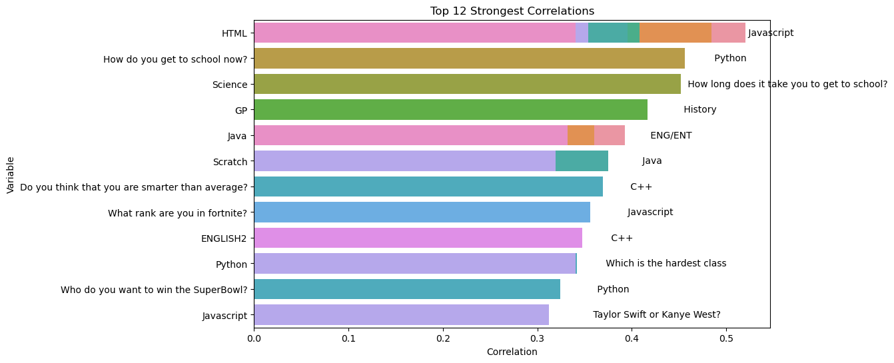

# Visualizations and explanations

This is also available on my website in a [blog post](https://www.parthiv.dev/blog/ninthgrade-data-analysis)

## Links to sections

- [Visualizations and explanations](#visualizations-and-explanations)
  - [Links to sections](#links-to-sections)
  - [Code source](#code-source)
  - [Correlation chart](#correlation-chart)
  - [Strongest correlations](#strongest-correlations)
  - [Calculating the strongest correlations](#calculating-the-strongest-correlations)

## Code source

All code is original content and available in `analysis.ipynb`. It works for my environment and on GitHub, so there's no reason it shouldn't work for you if you run everything sequentially.

## Correlation chart

The correlation matrix is used to find columns that relate to each other or _correlate_. This can help brainstorm ideas for future visualizations. My code randomly chooses 20 columns from the cleaned data and analyzes the correlation. You only need to look at the data under and to the left of the red squares as it is mirrored to the other side.

## Strongest correlations

My code selects the 12 strongest correlations from the 58x163 cleaned dataset.

On a side note, I wanted to talk about the complexity of these operations and the math behind them.

## Calculating the strongest correlations

Let's break this down:

- Calculating the pairwise correlation for a matrix of size `m x n` (m is the number of rows, n is the number of columns) generally has a time complexity of `O(n^2 * m)` because each pair of columns requires O(m) operations to compute. There are Nc2 pairs which is `n^2 / 2`. **For this dataset**, this is `58 * 58 * 0.5 * 163` or about 274, 000.

- Getting the absolute value of the matrix is O(n^2) as it requires going through each element of the `n x n` correlation matrix but this is a minor operation compared to calculating the correlation.

- Creating the mask also takes O(n^2) as we are iterating over the `n x n` matrix again to set the triangle.

- Unstacking the matrix which moves it from a 2D array to a 1D one with labels takes `O(n^2 log(n^2))` which is equal to `O(2 n^2 log n)` since there are n^2 elements in the correlation matrix and sorting them takes `O(n^2 log n)`.
- Selecting the top 12 correlations is just O(1) because you just pick the top 12 elements form the sorted elements.
